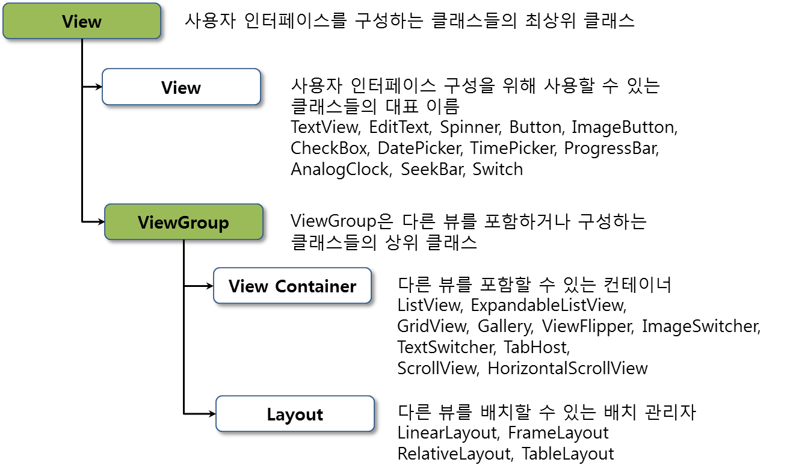

## 안드로이드 기본 위젯 살펴보기

안드로이드 화면을 구성할 때 사용할 수 있는 인터페이스 요소는 모두 View 클래스를 상속하고 있으며 위젯(Widget)이라고 부르기도 한다. 그리고 ViewGroup 클래스를 상속하고 있는 요소들은 다른 인터페이스 요소들을 포함할 수 있으며 이 중에서 Layout이라는 이름을 가진 클래스를 배치관리자(LayoutManager)라고 한다. 

그림에서 View와 ViewGroup은 실제 존재하는 클래스 이름이며 View Container와 Layout은 뷰들을 구분해서 부르기 위한 이름이다. 그리고 ViewGroup은 다른 뷰들을 그룹화할 수 있도록 만들어진 View 클래스를 상속한 클래스이다.

그림에서 기존에 존재한 뷰 및 레이아웃외에 TabLayout, RecyclerView, CardView, ConstarintLayout 등 여러가지 것들이 더 추가되었다.

**1. 텍스트 뷰**
>java.lang.Object
> >↳ android.view.View
> > >↳ android.widget.TextView

텍스트 뷰는 화면에 고정된 텍스트 문자열을 표시하는 뷰이다. 이 뷰의 문자열은 사용자가 수정할 수 없다.
텍스트 뷰는 사용자 인터페이스를 구성하는 가장 기본적인 뷰이다. 그래서 에디트텍스트나 버튼들이 텍스트뷰를 상속해서 만들어졌다. 

TextView의 xml 코드

	<TextView 
        android:layout_width="wrap_content"
        android:layout_height="wrap_content" 
        android:text="텍스트 뷰 내용" 
        android:lines="2"
        android:textSize="12sp"
        android:autoLink="web|email"
        /> 

**2. 에디트 텍스트(EditText)**

>java.lang.Object
> >↳ android.view.View
> > >↳ android.widget.TextView
> > > >↳ android.widget.EditText

입력 기능을 제외하고 텍스트뷰와 동일하다. TextView의 하위클래스이며, 화면을 오래 눌러 컨텍스트 메뉴 실행가능(복사, 잘라내기, 붙여넣기)

EditText의 xml 코드

	<EditText 
        android:id="@+id/EditText1"
        android:layout_width="match_parent"
        android:layout_height="wrap_content"
        android:hint="type here"
        android:editable="false"
        android:singleLine="false" 
        />

* 주요기능
	* android:hint="type here" : 
	 사용자 입력 전에 보여지며 입력하면 사라진다.
	* android:editable="false" : 
	 사용자 입력을 금지하고 싶으면 false, 입력할 수 있게 하고 싶다면 true를 설정한다.
	* android:singleLine="false" : 
	 자동으로 라인을 아래로 내리고 싶다면 false를 설정하고 한 개 라인만 보여주고 싶다면 true를 설정한다.

**3. 버튼(Button)**

* 상속계층도
>java.lang.Object
> >↳ android.view.View
> > >↳ android.widget.TextView
> > > >↳ android.widget.Button

* 버튼의 종류 
	* CheckBox
	* ToggleButton
	* Switch
	* RadioButton
	* ImageButton

기본적으로 버튼은 텍스트뷰를 상속하여 만들어졌다.

Button의 xml 코드

	<Button
   	 	android:layout_width="wrap_content"
    	android:layout_height="wrap_content"
    	android:text="Basic Button" />

* 주요기능
	* android:text="Basic Button" : 
	 버튼에 보여질 텍스트를 지정하는 속성이다.