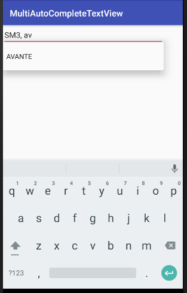

## 안드로이드 기본 위젯 살펴보기

안드로이드 화면을 구성할 때 사용할 수 있는 인터페이스 요소는 모두 View 클래스를 상속하고 있으며 위젯(Widget)이라고 부르기도 한다. 그리고 ViewGroup 클래스를 상속하고 있는 요소들은 다른 인터페이스 요소들을 포함할 수 있으며 이 중에서 Layout이라는 이름을 가진 클래스를 배치관리자(LayoutManager)라고 한다. 

그림에서 View와 ViewGroup은 실제 존재하는 클래스 이름이며 View Container와 Layout은 뷰들을 구분해서 부르기 위한 이름이다. 그리고 ViewGroup은 다른 뷰들을 그룹화할 수 있도록 만들어진 View 클래스를 상속한 클래스이다.

그림에서 기존에 존재한 뷰 및 레이아웃외에 TabLayout, RecyclerView, CardView, ConstarintLayout 등 여러가지 것들이 더 추가되었다.

### 기본 위젯 종류 및 특징
---
**1. 텍스트 뷰**
>java.lang.Object
> >↳ android.view.View
> > >↳ android.widget.TextView

텍스트 뷰는 화면에 고정된 텍스트 문자열을 표시하는 뷰이다. 이 뷰의 문자열은 사용자가 수정할 수 없다.
텍스트 뷰는 사용자 인터페이스를 구성하는 가장 기본적인 뷰이다. 그래서 에디트텍스트나 버튼들이 텍스트뷰를 상속해서 만들어졌다. 

TextView의 xml 코드

	<TextView 
        android:layout_width="wrap_content"
        android:layout_height="wrap_content" 
        android:text="텍스트 뷰 내용" 
        android:lines="2"
        android:textSize="12sp"
        android:autoLink="web|email"
        /> 

---
**2. 에디트 텍스트(EditText)**

>java.lang.Object
> >↳ android.view.View
> > >↳ android.widget.TextView
> > > >↳ android.widget.EditText

입력 기능을 제외하고 텍스트뷰와 동일하다. TextView의 하위클래스이며, 화면을 오래 눌러 컨텍스트 메뉴 실행가능(복사, 잘라내기, 붙여넣기)

EditText의 xml 코드

	<EditText 
        android:id="@+id/EditText1"
        android:layout_width="match_parent"
        android:layout_height="wrap_content"
        android:hint="type here"
        android:editable="false"
        android:singleLine="false" 
        />

* 주요기능
	* android:hint="type here" : 
	 사용자 입력 전에 보여지며 입력하면 사라진다.
	* android:editable="false" : 
	 사용자 입력을 금지하고 싶으면 false, 입력할 수 있게 하고 싶다면 true를 설정한다.
	* android:singleLine="false" : 
	 자동으로 라인을 아래로 내리고 싶다면 false를 설정하고 한 개 라인만 보여주고 싶다면 true를 설정한다.

---
**3. 버튼(Button)**

* 상속계층도
>java.lang.Object
> >↳ android.view.View
> > >↳ android.widget.TextView
> > > >↳ android.widget.Button

* 버튼의 종류 
	* CheckBox
	* ToggleButton
	* Switch
	* RadioButton
	* ImageButton

기본적으로 버튼은 텍스트뷰를 상속하여 만들어졌다.

Button의 xml 코드

	<Button
   	 	android:layout_width="wrap_content"
    	android:layout_height="wrap_content"
    	android:text="Basic Button" />

* 주요기능
	* android:text="Basic Button" : 
	 버튼에 보여질 텍스트를 지정하는 속성이다.

---
**4. 이미지뷰(ImageView)**

* 상속계층도
>java.lang.Object
> >↳ android.view.View
> > >↳ android.widget.ImageView

이미지를 보여주기 위해 만들어 졌다.

Button의 xml 코드

	<ImageView
        android:layout_width="wrap_content"
        android:layout_height="wrap_content"
        android:contentDescription="이미지없을 때 표시 문자열"
        android:src="@drawable/이미지" />

* 주요기능
	* **android:contentDescription="이미지없을 때 표시 문자"**
		
		이미지를 보여줄 수 없는 경우 대체할 문자열이다. HTML img 태그의 alt 속성과 비슷하다.
	* **android:src="@drawable/이미지"**
		
		 XML에서 이미지를 지정할 때는 확장자를 지정하지 않아야 한다. 그리고 @drawable는 drawable 디렉터리를 가리키지만 실제 drawable 디렉터리는 여러 개가 있다. 이 중에서 어떤 디렉터리를 가리킬지는 화면 해상도를 기준으로 안드로이드가 실행 시간에 정한다.

* 안드로이드에서 지원하는 이미지 형식

	이미지 확장자	설명
		
	* **.png** : PNG 이미지
	* **.9.png** : 나인패치 이미지라 불리며, 이미지 확대 시 특정 영역만 확대할 수 있게 하여 이미지 전체 모양을 일정하게 유지시켜 주는 이미지
	* **jpg** :	JPG 이미지
	* **gif** :	GIF 이미지

		※ 가능하면 jpg, png 사용을 권장하며, 이미지를 프로젝트에 추가할 때는 숫자, 언더바(_), 영문 소문자만을 사용하되, 이미지 이름은 반드시 영문 소문자로 시작해야 한다.

---
**5. 체크박스(CheckBox)**

* 상속계층도
>java.lang.Object
> >↳ android.view.View
> > >↳ android.widget.TextView
> > > >↳ android.widget.Button
> > > > >↳ android.widget.CompoundButton
> > > > > >↳ android.widget.CheckBox

체크 박스는 체크박스를 표시하는 이미지 부분과 체크박스 옆 문자열을 표시할 수 있는 텍스트로 구성되어 있다.

**CheckBox의 xml 코드**

	<CheckBox
    	android:layout_width="wrap_content"
   		android:layout_height="wrap_content"
    	android:text="check" />

* 주요기능
	* **android:text="check"** 체크박스 옆에 나오는 문자열이다.
	* 원한다면 **android:checked="true"**를 추가해서 <U>처음부터 체크된 상태</U>로 보여줄 수 있다.

---
**6. 토글버튼(ToggleButton)**

* 상속계층도
>java.lang.Object
> >↳ android.view.View
> > >↳ android.widget.TextView
> > > >↳ android.widget.Button
> > > > >↳ android.widget.CompoundButton
> > > > > >↳ android.widget.ToggleButton

토글버튼은 전원스위치 처럼 ON,OFF를 표시하는 버튼이다.

**ToggleButton의 xml 코드**

	<ToggleButton
    	android:layout_width="wrap_content"
   		android:layout_height="wrap_content"
    	android:text="Toggle"
    	android:textOff="Off"
    	android:textOn="On" />

* 주요기능
	* **android:text="Toggle"**
	
		의미 없는 문자열이다. ToggleButton이 TextView를 상속하기 때문에 이렇게 선언해도 전혀 문제가 발생하지는 않지만 실제로 화면에 표시되지는 않는다.
	* **android:textOn="On"** 상태가 On일 경우에 표시되는 문자열이다.
	* **android:textOff="Off"**	상태가 Off일 경우에 표시되는 문자열이다.

---
**7. 스위치(Switch)**

* 상속계층도
>java.lang.Object
> >↳ android.view.View
> > >↳ android.widget.TextView
> > > >↳ android.widget.Button
> > > > >↳ android.widget.CompoundButton
> > > > > >↳ android.widget.Switch

스위치는 전원스위치 처럼 ON,OFF를 표시하는 버튼이며 토글버튼과 유사하다.

**Switch의 xml 코드**

	<Switch
    	android:layout_width="wrap_content"
    	android:layout_height="wrap_content"
    	android:textOff="Off"
    	android:textOn="On"
    	android:checked="true" />

* 주요기능
	* **android:textOn="On"** 상태가 On일 경우에 표시되는 문자열이다.
	* **android:textOff="Off"** 상태가 Off일 경우에 표시되는 문자열이다.
	* **android:checked="true"** true일 경우 상태를 On으로 설정하며 false일 때는 Off로 설정한다.

---
**8. 라디오버튼(RadioButton)**

* 상속계층도
>java.lang.Object
> >↳ android.view.View
> > >↳ android.widget.TextView
> > > >↳ android.widget.Button
> > > > >↳ android.widget.CompoundButton
> > > > > >↳ android.widget.RadioButton

라디오 버튼은 여러 개 중에서 한개를 선택할 수 있는 선택버튼이다.

* RadioGroup으로 묶었을 경우, 사용자가 일단 선택하면 다시 선택해도 해지되지 않음.
* 일반적으로 RadioGroup으로 여러개의 RadioButton을 묶어 한개의 RadioButton만이 선택할 수 있게함.

**RadioGroup의 xml 코드**

	<RadioGroup
   		android:layout_width="wrap_content"
    	android:layout_height="wrap_content" >

    	<RadioButton
        	android:layout_width="wrap_content"
        	android:layout_height="wrap_content"
        	android:checked="true"
        	android:text="Option 1" />

    	<RadioButton
        	android:layout_width="wrap_content"
        	android:layout_height="wrap_content"
        	android:text="Option 2" />

    	<RadioButton
        	android:layout_width="wrap_content"
        	android:layout_height="wrap_content"
        	android:text="Option 3" />

    	<RadioButton
        	android:layout_width="wrap_content"
        	android:layout_height="wrap_content"
        	android:text="Option 4" />
	</RadioGroup>

* 주요기능
	* **android:text="Option 1"** 라디오 버튼 옆에 표시되는 텍스트이다.
	* **android:checked="true"** true일 경우 라디오버튼 선택 상태로 표시 false일 때는 선택하지 않은 상태로 표시한다.

---
**9. 스피너(Spinner)**

* 상속계층도
>java.lang.Object
> >↳ android.view.View
> > >↳ android.view.ViewGroup
> > > >↳ android.widget.AdapterView<T extends android.widget.Adapter>
> > > > >↳ android.widget.AbsSpinner
> > > > > >↳ android.widget.Spinner

스피너는 선택박스를 클릭하면 여러 아이템들을 보여주는 뷰이다. 작은 화면에서 사용자가 다양한 선택을 해야할 때 유용하다.

스피너는 일반적으로 우리가 알고 있는 컴보박스, 셀렉트박스와 많이 유사하다.

* 아이템들은 어댑터나 배열로 설정가능
* getSelectedView() 메소드로 선택한 텍스트를 가지고 올 수 있음..
* XML의 android:prompt 속성에는 반드시 문자열 자원 참조를 설정해야 함.

<U>특징적으로 스피너는 목록과 함께 표시해야하기 때문에 Adapter를 이용한다는 것에 유의해야한다.</U>

즉, 자바코드 상에서 Adapter로 레이아웃과 데이터를 맵핑해주어야 한다.

**Spinner의 xml 코드(activity_main.xml) **

	<Spinner
        android:id="@+id/spinner"
        android:layout_width="368dp"
        android:layout_height="wrap_content"
        tools:layout_editor_absoluteX="8dp"
        tools:layout_editor_absoluteY="50dp" />

**Spinner의 자바 코드(MainActivity.java) **
	
	 	String[] str ={"가족","이우열","조명순", "이현기","이현아","이현민"};	// 스피너 리스트 배열
        ArrayAdapter<String> adapter = new ArrayAdapter<String>
		(this,android.R.layout.simple_spinner_dropdown_item,str);	
		//배열 어댑터에 안드로이드에 기본으로 있는 드롭다운 형식의 스피너 레이아웃을 연결하고 데이터 배열을 맵핑한다. 
        Spinner spi = (Spinner)findViewById(R.id.spinner);		// 스피너 xml을 가져와 객체화한다.	
        spi.setAdapter(adapter);	//스피너에 생성한 어댑터를 연결한다.

---
**10. 시크바(SeekBar)**

* 상속계층도
>java.lang.Object
> >↳ android.view.View
> > >↳ android.widget.ProgressBar
> > > >↳ android.widget.AbsSeekBar
> > > > >↳ android.widget.SeekBar

시크바는 ProgressBar를 확장하여 사용자가 터치로 상태를 변경할 수 있도록 한 뷰이다. 시크바는 볼륨 조절이나 화면 밝기 조절 등에 사용할 수 있으며 발생된 이벤트는 <U>SeekBar.OnSeekBarChangeListener</U> 인터페이스를 통해 처리할 수 있다.

* RadioGroup으로 묶었을 경우, 사용자가 일단 선택하면 다시 선택해도 해지되지 않음.
* 일반적으로 RadioGroup으로 여러개의 RadioButton을 묶어 한개의 RadioButton만이 선택할 수 있게함.

**SeekBar xml 코드**

	 <SeekBar
        android:id="@+id/seek"
        android:layout_width="match_parent"
        android:layout_height="wrap_content"
        android:max="100"
        android:progress="50"
        android:secondaryProgress="75" />

* 주요기능
	* **android:max="100"** : 시크바의 최대 값
	* **android:progress="50"** : 시크바의 현재 값
	* **android:secondaryProgress="75"** : 시크바의 기준값이며 사용자에게 어느정도 움직이는 것이 적당한지 보여주는 값이다. 살짝 진한색으로 시크바에 표시됨.

---
**11. 카드뷰(CardView)**

* 상속계층도
>java.lang.Object
> >↳ android.view.View
> > >↳ android.view.ViewGroup
> > > >↳ android.widget.FrameLayout
> > > > >↳ android.support.v7.widget.CardView

카드 뷰는 쉽게 말해 라운드된 코너나 백그라운드를 가지는 프레임 레이아웃이라고 할수 있다. 
카드뷰는 elevation을 사용하여 그림자의 크기나 구분을 만든다.

카드뷰의 처음 적용은 안드로이드 4.4(kitkat)에서 처음 적용되었지만, <u>안드로이드 5.0(Lollipop)에서 기본 적용</u>되어 사용되었다. 

보통 카드뷰는 리사이클러뷰 또는 리스트 뷰와 많이 사용되며, 최근 트랜드는 리사이클러뷰와 많이 사용된다.

카드뷰는 안드로이드에 기본적으로 탑재되어 있는 라이브러리가 아니라 <u>외부 support 라이브러리에서 추가</u>해야하므로 dependency에서 컴파일SDK 버전에 맞게 라이브러리를 추가해주어야 한다. 컴파일버전이 26이므로 26버전의 라이브러리 추가

**build.gradle(Module:app) 파일**

	dependencies {
   	 	compile fileTree(dir: 'libs', include: ['*.jar'])
    	androidTestCompile('com.android.support.test.espresso:espresso-core:2.2.2', {
        exclude group: 'com.android.support', module: 'support-annotations'
    	})

    	compile 'com.android.support.constraint:constraint-layout:1.0.2'
    	testCompile 'junit:junit:4.12'
    	compile 'com.android.support:cardview-v7:26.+'	// 이 부분과
    	compile 'com.android.support:appcompat-v7:26.+'	// 이 부분 추가
	}

라이브러리를 보면 **-v7:26.+**으로 나타나있는데 이것은 안드로이드 7이하 하위호환, 컴파일러 26이상의 최신라이브러리를 적용한다는 뜻이다.

**CardView xml 코드**

	 <android.support.v7.widget.CardView
        android:layout_width="368dp"
        android:layout_height="wrap_content"
        tools:layout_editor_absoluteX="8dp"
        tools:layout_editor_absoluteY="326dp"
        app:cardElevation="10dp">
        
            <TextView
                android:layout_width="match_parent"
                android:layout_height="wrap_content"
                android:text="안녕핫요"/>
        
    </android.support.v7.widget.CardView>

* 주요기능
	* **app:cardElevation="10dp"** : 카드뷰의 높이를 설정할 수 있다.
	* **app:cardMaxElevation="10dp"** : 
		* 카드뷰의 높이의 최대 값 - 이 설정은 앱 변화가 동적으로 권한 상승 할 때 유용
	* **app:cardCornerRadius="10dp"** : 카드뷰의 모든 구석의 모서리 반경 설정
	* **app:cardBackgroundColor="#eee"** : 카드뷰 배경색 설정

---
**12. 자동완성 텍스트뷰(AutoCompleteTextView)**

* 상속계층도
>java.lang.Object
> >↳ android.view.View
> > >↳ android.widget.TextView
> > > >↳ android.widget.EditText
> > > > >↳ android.widget.AutoCompleteTextView

자동완성 텍스트 뷰는 사용자 입력을 자동으로 완성해주는 텍스트뷰이다. 이름은 텍스트뷰이지만 실제로는 EditText에 더 가깝다.

자동완성 텍스트뷰에서는 만약, "sm"이라는 단어를 입력하면 "sm"으로 시작하는 단어를 리스트 형태로 보여준다. 이렇게 동작하기 위해서는 <u>몇 글자를 입력했을 때 보여줄지를 지정하는 속성</u>과 <u>리스트 형태로 보여줄 문자열이 미리 정의</u> 되어있어야 한다.

**AutoCompleteTextView xml 코드**

	  <AutoCompleteTextView
        android:id="@+id/edit"
        android:layout_width="match_parent"
        android:layout_height="wrap_content"
        android:completionHint="pick an item"
        android:completionThreshold="2" />

* 주요기능
	* **android:completionHint="pick an item"** : 문자열 리스트 하단에 표시할 문자열이다.
	* **android:completionThreshold="2"** : 
		* 사용자가 입력한 글자가 몇 글자일 때 문자열 리스트를 보여줄지를 지정하는 속성이다.

사용자가 문자열 입력 시 자동으로 보여줄 문자열들은 ArrayAdapter를 사용해서 자동완성 텍스트뷰에 설정해야 한다. 

**MainActivity.java 코드**

	public class MainActivity extends AppCompatActivity {

    	@Override
    	protected void onCreate(Bundle savedInstanceState) {
    	    super.onCreate(savedInstanceState);
    	    setContentView(R.layout.activity_main);
    	    String[] items = { "SM3", "SM5", "SM7", "SONATA", "AVANTE", "SOUL", "K5", "K7" };
    	    
			AutoCompleteTextView edit = (AutoCompleteTextView) findViewById(R.id.autoCompleteTextView);
			
			ArrayAdapter<String> adapter;
			adapter = new ArrayAdapter<String>(this,android.R.layout.simple_dropdown_item_1line, items);
    	    edit.setAdapter(adapter);
    	}
	}

ArrayAdapter의 android.R.layout.simple_dropdown_item_1line는 문자열들을 보여주는 리스트 모양이며, items는 화면에 보여질 문자열들을 가지고 있는 문자열 배열이다.

---
**13. 멀티 자동완성 텍스트뷰(MultiAutoCompleteTextView)**

* 상속계층도
>java.lang.Object
> >↳ android.view.View
> > >↳ android.widget.TextView
> > > >↳ android.widget.EditText
> > > > >↳ android.widget.AutoCompleteTextView
> > > > > >↳ android.widger.MultiAutoCompleteTextView

멀티 자동완성 텍스트뷰는 사용자 입력을 자동으로 완성해주는 텍스트뷰이다. 멀티 자동완성 텍스트뷰는 <u>자동완성 텍스트뷰와 한가지 차이점</u>을 제외하고는 동일한다.
	
* 여러 개의 단어 완성
* 토크나이저 설정 필요(CommaTokenizer:쉼표로 단어들 구분)

자동완성 텍스트뷰는 한개의 단어만을 자동으로 완성시켜주며, 멀티 자동완성 텍스트뷰는 여러 개의 단어를 자동으로 완성시켜 준다. 그래서 멀티 자동완성 텍스트뷰는 자동완성 텍스트뷰를 기반으로 만들어졌다.

아래 그림은 **콤마토크나이저**를 이용한 멀티 자동완성 텍스트뷰이다.

**MultiAutoCompleteTextView xml 코드**

	  <MultiAutoCompleteTextView
    	android:id="@+id/edit"
    	android:layout_width="match_parent"
    	android:layout_height="wrap_content"
    	android:completionHint="pick an item"
    	android:completionThreshold="2" />

주요기능은 자동완성텍스트뷰와 동일하며, 여기서 중요한 것은 <u>MultiAutoCompleteTextView.CommaTokenizer()</u>이다

**MainActivity.java 코드**

	public class MainActivity extends AppCompatActivity {

    	@Override
    	protected void onCreate(Bundle savedInstanceState) {
        	super.onCreate(savedInstanceState);
        	setContentView(R.layout.activity_main);

        	String[] items = { "SM3", "SM5", "SM7", "SONATA", "AVANTE", "SOUL", "K5", "K7" };

        	MultiAutoCompleteTextView medit;
        	medit = (MultiAutoCompleteTextView)findViewById(R.id.multiAutoCompleteTextView);

			// 중요! 자동완성텍스트뷰와 차이점
        	medit.setTokenizer(new MultiAutoCompleteTextView.CommaTokenizer()); 
			
        	ArrayAdapter<String> adapter;
			adapter = new ArrayAdapter<String>(this,android.R.layout.simple_dropdown_item_1line, items);
    	    medit.setAdapter(adapter);

    	}
	}

 이 코드의 기능으로 인해 여러 단어를 구분하여 매번 자동완성 리스트가 보여질 수 있는 것이다. 현재는 단어를 콤마(,)로만 구분할 수 있는 토크나이저를 제공하고 있으므로, 다른 문자를 이용하고 싶다면 직접 만들어서 사용해야 한다.