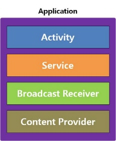
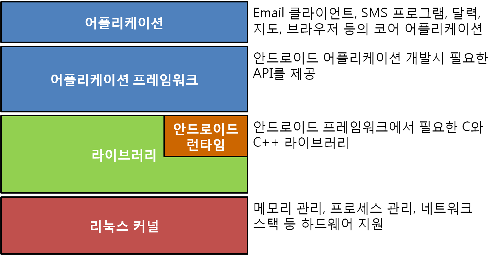
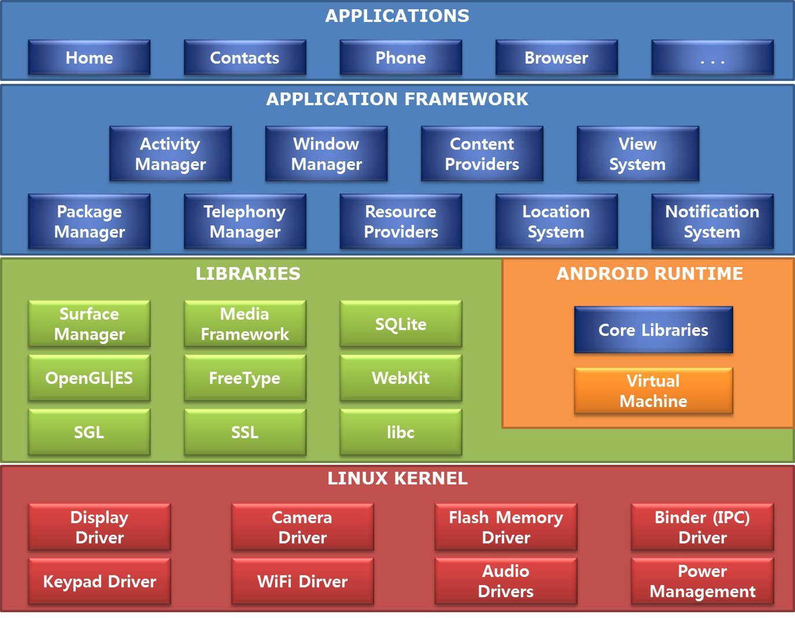

## 안드로이드의 이해와 환경 ##

### 1. 안드로이드의 개념 ###

스마트폰은 2007년 애플의 아이폰이 나오면서 등장하게 되었고 애플의 아이폰에 대응하여 안드로이드 폰이 생성되었다. 
안드로이드는 구글에서 제작하여 오픈 OS로 많은 사람들이 사용할 수 있다. 

안드로이드는 다음과 같은 특징은 가지고 있다.

* **오픈소스** : 오픈소스 기반으로 아파치 2.0라이센스를 사용한다.
* **스마트폰을 위한 컴포넌트 제공**
* **누구나 만들 수 있는 무료 플랫폼**
* **자바 개발 언어**
* **뛰어난 성능** : 버추얼 머신을 사용하면서도 빠르다.**(ART Runtime 사용)**  

가장 큰 특징은 오픈소스로 많은 개발자들의 기여와 참여로 안드로이드 플랫폼의 단점이 지속적으로 개선되고 있으며 많은 사람들이 개발에 참여하게 되었다.

#### 안드로이드 이해관계 ####

* 안드로이드 사용자 – 다양하고 많은 콘텐츠
* 안드로이드 개발자 – 콘텐츠 개발을 통한 수익
* 이동통신 사업자 – 수익성 높은 방식으로 콘텐츠 통제
* 단말기 제조사 – 저렴한 비용으로 플랫폼 사용

#### 안드로이드 플랫폼 특징 ####

안드로이드 라이선스 중 GPL은 소스를 수정할 경우 공개해야 하는 반면, Apache2는 소스를 수정하더라도 소스를 공개할 필요가 없다. 그래서 애플리케이션은 소스 공개를 하지 않아도 되지만, 안드로이드 운영체제를 수정하는 경우에는 소스 공개를 해야 한다.

* 라이선스 사용로나 개발/배포 비용이 들지 않음 
	
	- 안드로이드 운영체제 : GPL v2
	- 안드로이드 플랫폼: ASL/Apache2

* 카메라, 각종 센서, GPS, Wi-Fi 등의 하드웨어 접근이 가능
* 구글 맵 지원
* 백그라운드 서비스 지원
* SQLite 데이터베이스 지원
* 공유 데이터와 애플리케이션 간의 통신 지원
* 2D/3D 지원
* 최적화된 메모리와 프로세스 관리

---
### 2. 안드로이드 구성요소 ###

안드로이드의 주요 4대 컴포넌트라고도 한다.

	액티비티, 서비스, 브로드캐스트 리시버, 콘텐트 프로바이더

안드로이드 3.0(API Level 11)부터는 프래그먼트가 추가되었다.

그러므로 안드로이드 3.0 이후 부터 핵심 컴포넌트는 

	액티비티, 서비스, 브로드캐스트 리시버, 콘텐트 프로바이더, 프래그먼트

로 정리할 수 있다.

* 안드로이드 주요 용어 정리
	
	1. **액티비티(Activity)** : 사용자 인터페이스 화면을 구성하는 컴포넌트
	2. **서비스(Service)** : 백그라운드에서 실행되는 컴포넌트, 시각적인 사용자 인터페이스를 가지지 않음.
	3. **인텐트(Intent)** : 컴포넌트에 액션, 데이터 등을 전달하는 메시지 컴포넌트
	4. **인텐트 필터(Intent Filter)** : 수신할 수 있는 인텐트를 정의하여 컴포넌트를 정의하는 역할을 하는 컴포넌트
	5. **브로드캐스트 리시버(Broadcast Receiver)** : 배터리 부족, 언어 설정 변경 등의 특정 브로드캐스트를 수신하거나 반응하는 컴포넌트, 시각적인 사용자 인터페이스를 가지지 않음.
	6. **콘텐트 프로바이(Content Provider)** : 애플리케이션 간의 데이터 공유를 위해 표준화된 인터페이스를 제공하는 컴포넌트.
	7. **노티피케이션(Notification)** : 사용자에게 특정 이벤트를 알리는 컴포넌트
	8. **프레그먼트(Fragment)** : 액티비티 내에서 독자적으로 동작할 수 있는 UI컴포넌트

---

### 3. 안드로이드 버전별 특징 ###

* **컵케이크(Cupcake) - Android 1.5**
	- 가상키보드, 라이브 폴더, 음성 인식, 풀 스크린 위젯, 홈 스크린 기능
	- 복사/붙여 넣기 기능 추가
		
* **도넛(Donut) - Android 1.6**
	- 터치스크린 (제스쳐 API)
	- 문장을 목소리로 변환 (Text-to-Speech) TTS엔진 추가
	- 통합검색 기능(애플리케이션, 전화번호부, 구글, 지역 통합)
	
* **이클레어(프랑스어: Eclair 에클레르) - android 2.0~2.1**
	- 블루투스 2.1 지원
	- 멀티 터치 공식 지원
	- HTML5 지원, 카메라 지원 기능, 멀티미디어 재생기능 향상

* **프로요(Froyo, 프로즌 요구르트) - Android 2.2**
	- 새로운 실시간 컴파일러 적용 : 실행속도 2~5배 향상
	- 외장 메모리에 애플리케이션의 설치 지원
	- 핫스팟 지원, 플래시지원
	- 원격삭제, 자동잠김, 최소암호설정 추가
	
* **진저브레드(Gingerbread, 생강빵) - Android 2.3**
	- NFC 지원
	- VoIP, 자이로스코프, 회전벡터, 선형 가소그 중력, 기압계 센서 지원
	- UI 단순화 및 성능 개선
	- 복사/붙여넣기 드래그앤 드롭 방식으로 변경
	 
* **허니콤(Honeycomb, 허니콤 토피) - Android 3.0**
	- 태블릿 지원을 위한 홀로그래픽 UI적용
	- 화면분할을 위한 프래그먼트 기능지원
	- HTTP 라이브 스트리밍: URL을 미디어 프레임워크에서 사용할 수 있음.
	- 2D 그래픽 하드웨어 가속
	
* **아이스크림 샌드위치(Ice Cream Sandwich) - Android 4.0**
	- 태블릿과 스마트폰의 OS 버전 통합
	- 가상 홈키
	- 얼굴인식 기능 강화
	- 음성인식 텍스트 실시간 입력
	- WiFi 다이렉트: 두개의 단말 간에 WiFi를 통한 직접연결을 위해 소프트 AP(Soft Access Point)를 장착
	- NFC 빔 공유
	
* **젤리빈(Jelly Bean) - Android 4.1~4.3**
	- 그래픽 성능향
	- 웹뷰 기능 강화
	- 푸시 메시지 사용화
	
* **킷캣(KitKat) - Android 4.4**
	- 저사양 단말 지원
	- ART RunTime 추가
	- GPU 가속
	- 전체화면 모드
	
* **롤리팝(Lollipop) - Android 5.0**
	-  그래픽 성능향상 : Open GL ES 3.1지원
	-  머티리얼 디자인 적용
	-  64비트 CPU 정식 지원
	-  ART Runtime 기본 적용
	
* **마시멜로(Marshmallow) - Android 6.0**
	- 앱 권한 설정
	- 나우온탭 향상
	- 커스텀 탭기능 추가
	- 안드로이드 페이 추가
	- 지문 인식 API
	- 배터리 대기시간
	- USB C 도입
	
* **누가(Nougat) - Android 7.0**
	- 가상현식 플랫폼 '데이드림' 지원
	- JIT 컴파일러 추가
	
* **O - Android 8.0(예정)**
	- 백그라운드 제한
	- 알림 채널
	- 자동입력 API
	- 새로운 윈도우 추가(스마트TV와 같은 추가화면 적용)
	- 고품질 블루투스 오디오 코덱 지원
	- WI-Fi Aware 기능(핸드폰이 공유기 역할)

---
### 4. 안드로이드 개발환경 ###

안드로이드는 기본적으로 리눅스 커널 위에 탑재된 안드로이드 런타임인 ART Runtime(달빅에서 넘어옴)에서 동작한다. ART 런타임은 기본적으로 AOT 컴파일러를 사용하는데 현재는 달빅에서 사용되던 JIT 컴파일러와 ART의 AOT 컴파일러 방식 모두 사용한다.

**JIT 컴파일러** : 앱의 최초실행마다 코드를 변환하고 변환된 내용을 램 상에 올려 놓고 작업한다. 

**AOT 컴파일러** : 처음 인스톨 할때 필요한 컴파일 작업을 다 해놓으며, 설치시간 및 용량을 많이 차지한다.

#### 안드로이드 주요 컴포넌트를 각 영역별로 표현 ####

* **애플리케이션(APPLICATIONS)**: 자바로 개발된 애플리케이션이 위치하는 영역이며, 이메일 클라이언트, SMS 프로그램, 달력, 지도, 브라우저, 주소록 등의 애플리케이션이 탑재되어 있다. 또한 우리가 자바로 개발한 애플리케이션이 탑재되는 영역이 바로 여기이다.

* **애플리케이션 프레임워크(APPLICATION FRAMEWORK)**: 애플리케이션 프레임워크는 애플리케이션을 개발하기 위해 필요한 각종 API를 제공하는 영역이다. 이 영역에 있는 각종 API를 사용하면 화면에 버튼이나 텍스트 등을 표현하거나 주소록 같은 다른 애플리케이션의 데이터를 사용할 수도 있다. 또한 이미지, 문자열 등의 여러 데이터를 접근하거나 애플리케이션의 생명주기(lifecycle)를 관리하는 API도 이 영역에서 제공한다.

* **라이브러리(LIBRARIES)**: 안드로이드에서 사용할 수 있는 다양한 C/C++ 라이브러리를 제공하는 영역이다. 이 영역의 라이브러리는 모두 애플리케이션 프레임워크를 통해 개발자가 사용할 수 있게 하고 있다. BSD(버클리 소프트웨어 배포판)를 기반으로 한 표준 C 시스템 라이브러리가 임베디드 리눅스 기반의 디바이스에 맞게 수정되어 있으며, PacketVideo의 OpenCore를 기반으로 한 미디어 라이브러리는 MPEG4, H.264, MP3, AAC, AMR, JPG, PNG 등의 파일들을 지원한다. 서피스 매니저(surface manager)는 2D, 3D 그래픽를 지원하며, WebKit은 브라우저 기능을 지원한다. 그리고 임베디드용으로 개발된 데이터베이스 엔진인 SQLite(에스큐엘라이트)를 제공하고 있다.
 
* **안드로이드 런타임(ANDROID RUNTIME)**: 안드로이드는 자바 기반으로 동작하지만 JVM(자바 가상 머신, Java Virtual Machine)을 그대로 사용하지 않고 DVM(달빅 가상 머신, Dalvik Virtual Machine)을 사용하고 있다. 그래서 작성된 소스 코드(.java)는 자바 컴파일러에 의해 클래스 파일(.class)로 컴파일되며, 클래스 파일은 DX 컴파일러에 달빅 바이트 코드로 변환되며 달빅 실행파일(.dex, Dalvik Executable)과 최적화된 달빅 실행파일(.odex, Optimized Dalvik Executable)로 저장된다. 이 파일들은 안드로이드 기기에서 실행되기 그리고 달빅은 메모리가 작은 소형 기기에서도 효율적으로 동작할 수 있도록 최적화되어 있다. 참고로 안드로이드 4.4(킷캣) 이전에는 Dalvik 기반이었지만 4.4에서는 ART가 새롭게 도입되었으며 안드로이드 5.0(롤리팝)부터는 ART 기반으로 변경되었다.

* **리눅스 커널(LINUX KERNEL)**: 안드로이드는 리눅스 커널 3.0.1(안드로이드 4.0)을 기반으로 하며, 이를 통해 보안, 메모리 관리, 프로세스 관리, 네트워크 스택과 각종 드라이버를 제공한다.

#### TIP & TECH 달빅(Dalvik) ####
안드로이드는 자바 코드로 작성하기 때문에 자바 가상 머신(JVM, Java Virtual Machine) 상에서 동작한다고 생각할 수 있지만 실제로는 달빅 가상 머신(DVM, Dalvik Virtual Machine) 상에서 동작한다. 달빅은 자바 코드를 최적화시켜 소형 기기에서도 잘 작동할 수 있도록 해주며 자바 바이트 코드를 변환해서 확장자가 dex(Dalvik Executable)인 바이트 코드를 생성한다. 또한 달빅은 JIT(Just In Time) 컴파일 방식을 사용하기 때문에 앱을 실행할 때마다 바이트 코드를 머신 코드로 변경하며 이 과정에서 추가적인 메모리를 필요로 한다.안드로이드 4.4(킷캣)까지만 사용되었으며 5.0(롤리팝)부터는 ART로 변경되었다.

#### TIP & TECH ART(Android Run Time) ####
안드로이드 5.5(롤리팝)부터 기본으로 채택되었으며 다음과 같은 장점을 가지며 하위호환성을 위해 달빅과 동일한 바이트코드를 사용한다.

* AOT(Ahead-of-time) 컴파일
* 가비지컬렉션 기능 향상
* 디버깅 지원 기능 향상

ART에서 채택한 AOT 컴파일은 앱이 실행될 때 바이트 코드를 변환하는 대신에 앱이 설치될 때 DEX 바이트 코드를 머신 코드로 변환하는 작업을 한다. 그래서 설치 시간이 길어지지만 실행시간은 짧아지는 장점이 있다.

